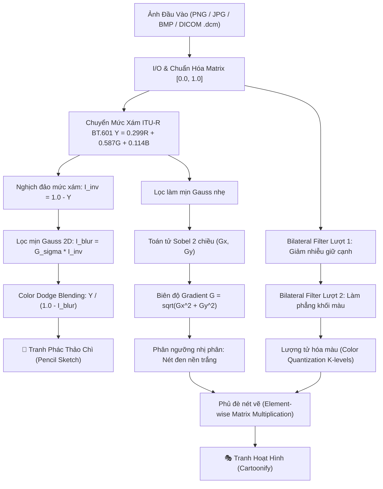

# TÀI LIỆU KỸ THUẬT & TOÁN HỌC GIẢI THUẬT XỬ LÝ ẢNH
## Đồ án: Xây dựng phần mềm chuyển ảnh thành tranh vẽ (Chương 5)
### Nhóm phát triển: vass05 | Công nghệ: Thuần Python & NumPy (Zero OpenCV)

---

## 1. Sơ đồ Kiến trúc & Luồng Dữ liệu (Data Pipeline)

---

## 2. Chi tiết Giải thuật Toán học (Mathematical Formulation)

### 2.1. Chuẩn hóa ma trận dữ liệu ảnh đa nguồn
- **Ảnh số thông thường (8-bit):**
  $$I_{\text{norm}}(x, y) = \frac{I(x, y)}{255.0} \in [0.0, 1.0]$$
- **Ảnh y tế DICOM (CT Scan / X-quang 12-16 bit):**
  $$I_{\text{HU}}(x, y) = I_{\text{raw}}(x, y) \times \text{RescaleSlope} + \text{RescaleIntercept}$$
  $$I_{\text{norm}}(x, y) = \frac{I_{\text{HU}}(x, y) - \min(I_{\text{HU}})}{\max(I_{\text{HU}}) - \min(I_{\text{HU}})}$$

---

### 2.2. Chuyển đổi mức xám chuẩn ITU-R BT.601
Mắt người có độ nhạy cảm cao nhất với màu xanh lá cây (Green) và thấp nhất với màu xanh dương (Blue). Công thức độ chói tuyến tính chuẩn quốc tế:
$$Y = 0.299 \times R + 0.587 \times G + 0.114 \times B$$
Được vector hóa bằng phép tích vô hướng mảng NumPy nhiều chiều:
$$\mathbf{Y} = \mathbf{I}_{..., :3} \cdot [0.299, 0.587, 0.114]^T$$

---

### 2.3. Động cơ Tích chập 2D (2D Convolution Engine)
Định nghĩa tích chập rời rạc của ma trận ảnh $I$ với kernel $K$ kích thước $k_h \times k_w$:
$$(I * K)(x, y) = \sum_{i=-\lfloor k_h/2 \rfloor}^{\lfloor k_h/2 \rfloor} \sum_{j=-\lfloor k_w/2 \rfloor}^{\lfloor k_w/2 \rfloor} I(x - i, y - j) \cdot K(i, j)$$
**Tối ưu hóa vector hóa không lặp pixel:**
Lật kernel 180 độ: $K' = \text{flip}(K)$. Duyệt duy nhất theo kích thước kernel $(i, j) \in [0, k_h) \times [0, k_w)$ và tích lũy lát cắt song song trên toàn bộ ma trận:
$$\text{Output} \mathrel{+}= K'[i, j] \times \text{Padded}[i : i + H, \, j : j + W]$$
- Độ phức tạp không gian: $O(H \times W)$ (tuyệt đối không gây tràn bộ nhớ RAM).
- Độ phức tạp thời gian: $O(k_h \cdot k_w \cdot H \cdot W)$, thực thi bằng mã C tối ưu SIMD của NumPy.

---

### 2.4. Bộ lọc Làm mịn Gauss (Gaussian Blurring)
Hàm phân phối chuẩn 2 chiều đối xứng tâm:
$$G(x, y) = \frac{1}{2\pi \sigma^2} \exp\left( -\frac{x^2 + y^2}{2\sigma^2} \right)$$
Do tính khả tách (Separability) của hàm Gauss:
$$G(x, y) = g(x) \times g(y), \quad g(u) = \frac{1}{\sqrt{2\pi}\sigma} \exp\left(-\frac{u^2}{2\sigma^2}\right)$$
Tích chập 2D được phân rã thành hai lượt tích chập 1D dọc theo trục ngang (width) và trục dọc (height), giảm số phép tính từ $O(k^2)$ xuống $O(2k)$.

---

### 2.5. Trích xuất Biên độ Gradient bằng Toán tử Sobel
Cặp ma trận Sobel $3 \times 3$:
$$K_x = \begin{bmatrix} -1 & 0 & 1 \\ -2 & 0 & 2 \\ -1 & 0 & 1 \end{bmatrix}, \quad K_y = \begin{bmatrix} -1 & -2 & -1 \\ 0 & 0 & 0 \\ 1 & 2 & 1 \end{bmatrix}$$
- Đạo hàm theo phương ngang: $G_x = I * K_x$
- Đạo hàm theo phương dọc: $G_y = I * K_y$
- Độ lớn Gradient:
  $$G = \sqrt{G_x^2 + G_y^2}$$
- Mask phân ngưỡng tạo nét viền đen trên nền trắng:
  $$M(x, y) = \begin{cases} 0.0 & \text{nếu } G(x, y) \ge T_{\text{threshold}} \\ 1.0 & \text{nếu } G(x, y) < T_{\text{threshold}} \end{cases}$$

---

### 2.6. Bộ lọc Bảo toàn Biên (Bilateral Filter from Scratch)
Khác với Gaussian Blur làm mờ toàn bộ ảnh bao gồm cả các cạnh viền, Bilateral Filter kết hợp đồng thời hai trọng số:
$$BF[I]_p = \frac{1}{W_p} \sum_{q \in \Omega} I_q \cdot w_s(p, q) \cdot w_r(p, q)$$
1. **Trọng số không gian (Spatial Domain Weight):**
   $$w_s(p, q) = \exp\left( -\frac{\|p - q\|^2}{2\sigma_s^2} \right)$$
2. **Trọng số khoảng cách màu sắc/độ sáng (Range/Radiometric Weight):**
   $$w_r(p, q) = \exp\left( -\frac{\|I(p) - I(q)\|^2}{2\sigma_r^2} \right)$$
3. **Hệ số chuẩn hóa năng lượng:**
   $$W_p = \sum_{q \in \Omega} w_s(p, q) \cdot w_r(p, q)$$

Khi hai pixel $p$ và $q$ nằm ở hai bên của một vách tương phản (ví dụ: biên giới giữa đối tượng và nền), $\|I(p) - I(q)\|$ rất lớn $\Rightarrow w_r \approx 0$. Do đó, chúng không bị trộn lẫn màu vào nhau, giữ cho cạnh biên luôn sắc nét tuyệt đối.

---

### 2.7. Hòa trộn Color Dodge Blending (Hiệu ứng Phác thảo Chì)
Công thức chuẩn trong kỹ thuật xử lý đồ họa:
$$I_{\text{sketch}} = \min\left(255, \frac{I_{\text{gray}} \times 256}{255 - I_{\text{blur}} + 1}\right)$$
Với $I_{\text{blur}} = \text{Gaussian}(255 - I_{\text{gray}})$.
Khi giá trị $I_{\text{gray}}$ gần bằng $255 - I_{\text{blur}}$, mẫu số xấp xỉ nhỏ làm cho giá trị phân thức tăng vọt tới 255 (màu trắng giấy). Chỉ ở những nơi có gradient cạnh viền sắc nét, mẫu số và tử số có sự chênh lệch lớn tạo nên các nét chì sẫm màu với bóng đổ mềm mại.

---

### 2.8. Lượng tử hóa Màu sắc (Color Quantization)
Để tạo hiệu ứng tranh hoạt hình (cel-shading):
$$I_{\text{quantized}} = \frac{\text{round}(I \times (K - 1))}{K - 1}, \quad K \in [3, 16]$$
Các dải màu biến thiên liên tục sẽ được gom lại thành các mảng phẳng đồng nhất. Sau đó, phủ đè nét viền đen:
$$I_{\text{cartoon}} = I_{\text{quantized}} \times M_{\text{edge}}$$
